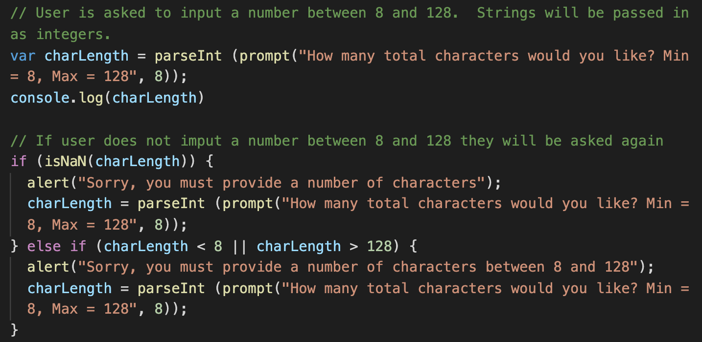

# GeneratePassword_HW3
Homework assignment 3 - Generating a random password using JavaScript

Link to the live page:

## Purpose
The purpose of this activity was to take a small amount of starter code, and create a fully functional password generator.  This generator takes user imputs to see how many characters they would like in the password (between 8 and 128), then if they would like to include lowercase, uppercase, special, and/or special characters.  After the code runs, the user is presented with a randomly generated password.

## Acceptance Criteria
```
GIVEN I need a new, secure password

WHEN I click the button to generate a password
THEN I am presented with a series of prompts for password criteria

WHEN prompted for password criteria
THEN I select which criteria to include in the password

WHEN prompted for the length of the password
THEN I choose a length of at least 8 characters and no more than 128 characters

WHEN asked for character types to include in the password
THEN I confirm whether or not to include lowercase, uppercase, numeric, and/or special characters

WHEN I answer each prompt
THEN my input should be validated and at least one character type should be selected

WHEN all prompts are answered
THEN a password is generated that matches the selected criteria

WHEN the password is generated
THEN the password is either displayed in an alert or written to the page
```

## Getting started
The starter code we were provided with contained the generate button itself, as well as the function that takes the main generatePassword() result and passes that in to the text box for the user to see.

The first step was to create variables for all lowercase, uppercase, numeric, and special characters.


## The bulk of the challenge
After creating all of the character variables, the user is then asked (using a prompt) how many characters they would like to include.  If the user does not enter a number, or does not enter a number between 8 and 128, they are prompted again:




Then, using confirm statements, the user chooses what types of characters they would like to include.  Those character arrays are concatenated onto the (initially) empty passwordArray.  Numbers are automatically given if the user declines all options.  Example of the lowercase if else statement:


Finally, a for loop is used to loop through the passwordArray, containing all the newly concatenated character arrays, charLength (number from inital user input) times, and random characters/numbers are passed in depending on which were true (confirmed statements).  The randomly generated password is then returned and is presented to the user:


## End result
This is indeed a fully functioning password generator, and my first JavaScript project!


## Made with the help and guidance of 
Christian Henry - TA <br>
Brandon Norsworthy <br>
Jessamyn McTwigan <br>
Jacob Guiro <br>
David Gauthier <br>


## License
[MIT](https://choosealicense.com/licenses/mit/)

## Contact
Harrison Kidd

harrisonakidd@gmail.com
